# THM Snort Challenge — Live Attacks

**Platform:** TryHackMe  
**Room:** Snort Challenge - Live Attacks  
**Category:** IDS/IPS · Network Security  
**Difficulty:** Medium  
**Tools Used:** Snort, Linux CLI (find, awk, sort)  
**Status:** Completed ✅

---

## Overview

This room simulates two real-time attacks against a fictional company's network. The task is to act as a SOC analyst/IPS engineer: investigate live traffic using Snort in sniffer mode, identify the attack pattern, write a custom Snort rule, and deploy it in IPS mode to block the attack in real time.

**Two scenarios covered:**
- **Scenario 1:** SSH Brute-Force Attack (inbound)
- **Scenario 2:** Reverse Shell via Metasploit (outbound)

---

## Scenario 1 — SSH Brute-Force Attack

### Background

J&Y Enterprise's network is under attack. Suspicious inbound traffic has been detected. The mission is to identify the attacker's IP, confirm the brute-force pattern, and write a Snort rule to block it.

---

### Step 1 — Capture Live Traffic (Sniffer Mode)

First, I ran Snort in sniffer mode to capture and log live traffic to disk:

```bash
sudo snort -dev -K ASCII -l .
```

**Flag breakdown:**

| Flag | Meaning |
|---|---|
| `-d` | Display packet payload data |
| `-e` | Display Ethernet header information |
| `-v` | Verbose mode — show packet details |
| `-K ASCII` | Save logs in ASCII format (human-readable) |
| `-l .` | Save logs to the current directory |

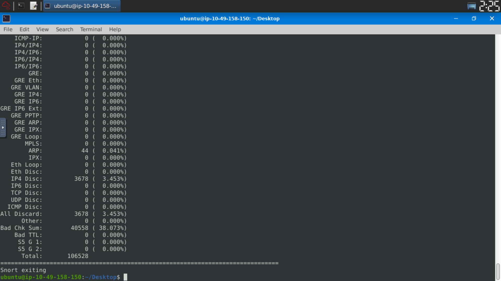

After stopping the capture, Snort created log directories named after the source IPs it saw:

---

### Step 2 — Investigate Log Directories

```bash
ls
```

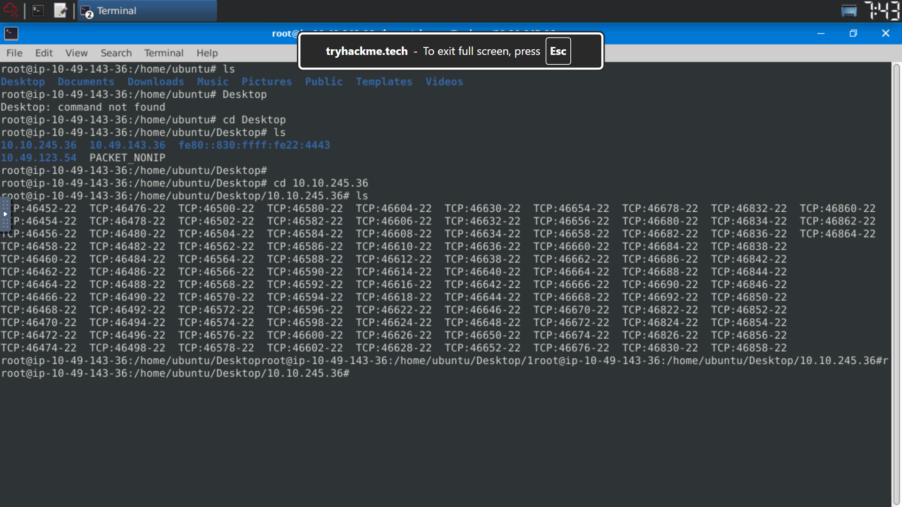

Three IP directories were created:
- `10.10.245.36`
- `10.49.123.54`
- `10.49.143.36`

I navigated into `10.10.245.36` — the external IP — and found a massive number of TCP log files all targeting **port 22** (SSH):

```bash
cd 10.10.245.36
ls
```

Hundreds of files with names like `TCP:46452-22`, `TCP:46454-22`, `TCP:46456-22`... all pointing to port 22. This immediately indicated SSH brute-forcing.

---

### Step 3 — Count Attack Attempts

To quantify the brute-force attempts, I used AWK to extract and count destination ports:

```bash
ls | awk -F'-' '{print $NF}' | sort | uniq -c | sort -rn
```

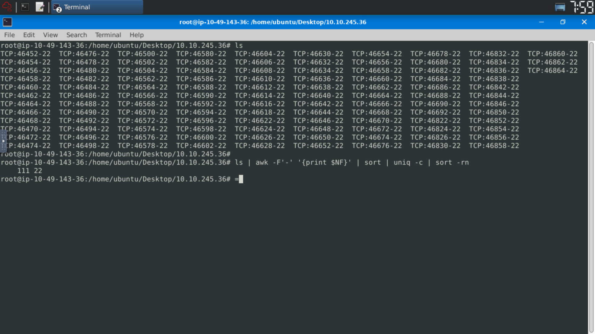

**Result: 111 connections to port 22** from a single source IP — far exceeding any legitimate SSH usage pattern.

**Why this is suspicious:**
- Normal SSH logins: 1-3 attempts
- 111 rapid consecutive attempts = automated brute-force tool

---

### Step 4 — Confirm Timing Pattern (Rapid-Fire Attempts)

To further confirm this is automated brute-forcing (not manual), I checked the timestamps of the connections:

```bash
find . -maxdepth 1 -name "TCP:*-22" -printf '%T@ %p\n' | sort -n | head -20
```

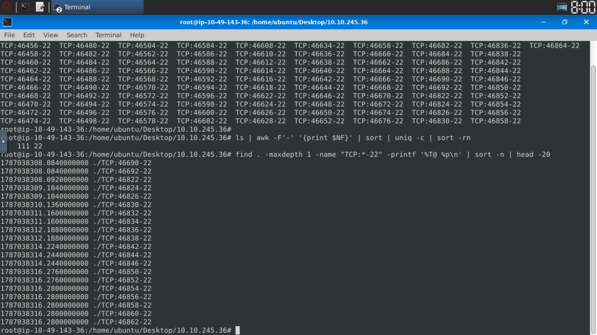

**Calculation:**
```
1787038316.280 − 1787038308.084 = 8.196 seconds
```

111 connections in ~8 seconds. This is impossible for a human — clearly automated. **Brute-force confirmed.**

---

### Step 5 — Write the Snort Blocking Rule

Navigate to the Snort rules directory:

```bash
cd /etc/snort
ls
cd rules
nano local.rules
```

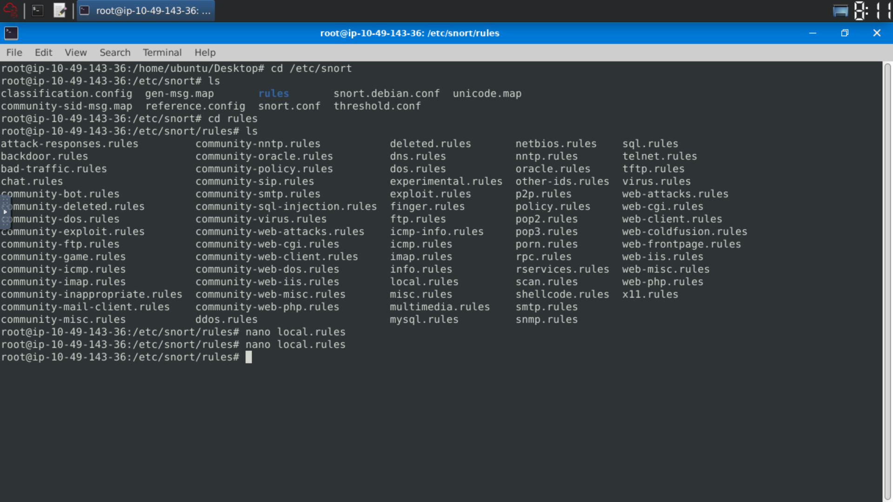

**Rule written:**

```snort
drop tcp 10.10.245.36 any -> 10.10.140.29 22 (msg:"Blocked SSH Brute-Force Attempt from Attacker";sid:1000001;rev:1;)
```

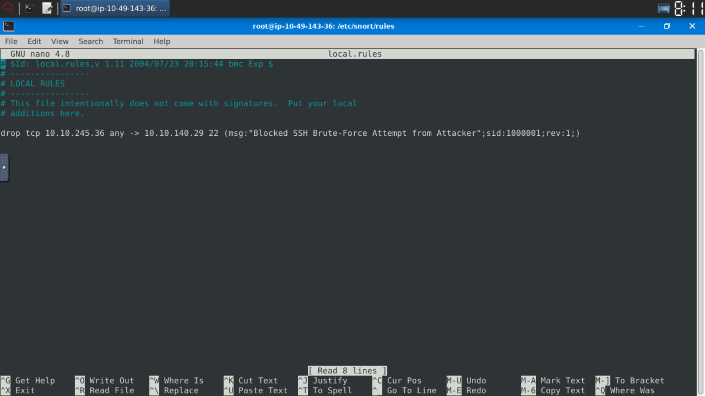

**Rule breakdown:**

| Component | Value | Meaning |
|---|---|---|
| `drop` | — | Block the packet (IPS mode) |
| `tcp` | — | Protocol: TCP |
| `10.10.245.36` | Source IP | Attacker's IP address |
| `any` | Source port | Any source port |
| `->` | — | Direction: one-way |
| `10.10.140.29` | Destination IP | Victim machine |
| `22` | Destination port | SSH port |
| `msg` | — | Alert message |
| `sid:1000001` | — | Unique rule ID (local rules start at 1000001) |
| `rev:1` | — | Rule version 1 |

---

### Step 6 — Deploy Snort in IPS Mode

```bash
snort -c /etc/snort/snort.conf -q -Q --daq afpacket -i eth0:eth1 -A full
```

**Flag breakdown:**

| Flag | Meaning |
|---|---|
| `-c /etc/snort/snort.conf` | Use main Snort configuration file |
| `-q` | Quiet mode — suppress banner |
| `-Q` | Enable inline IPS mode |
| `--daq afpacket` | Use AFPacket for packet capture (required for inline) |
| `-i eth0:eth1` | Monitor both interfaces for inline traffic |
| `-A full` | Display full alert details |

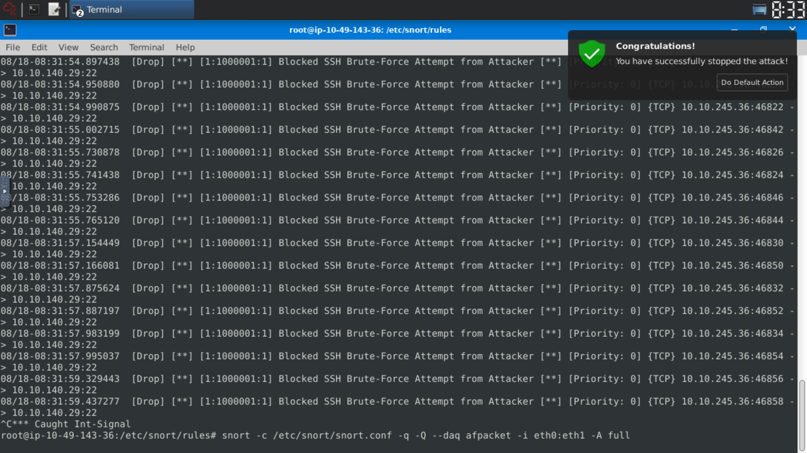

**Result:** Snort successfully detected and dropped all SSH brute-force packets from `10.10.245.36` to `10.10.140.29:22`. The TryHackMe "Congratulations" popup confirmed the attack was stopped. ✅

---

## Scenario 2 — Reverse Shell Detection & Blocking

### Background

After stopping the inbound attack, outbound traffic investigation revealed a more serious threat: a persistent reverse shell connection, indicating an attacker had **already compromised a machine inside the network**.

---

### Step 1 — Capture Outbound Traffic

```bash
sudo snort -dev -K ASCII -l .
```

Same command as Scenario 1 — capture all live traffic for analysis.

---

### Step 2 — Identify the Suspicious IP

After capture, listing the log directories revealed a new suspicious IP: `10.10.144.156`

```bash
cd 10.10.144.156
ls
```

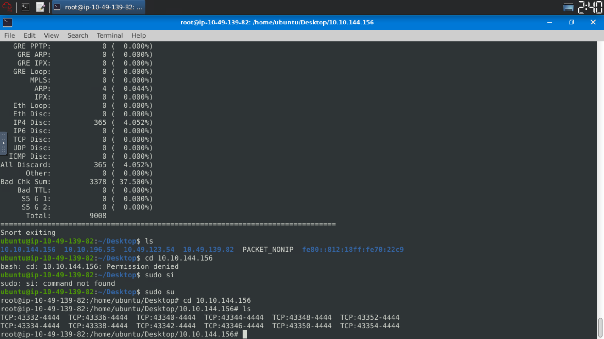

All log files showed connections to/from **port 4444** — the default listener port for Metasploit's Meterpreter reverse shell (`multi/handler`).

---

### Step 3 — Examine the Raw Traffic

Reading one of the log files revealed the bidirectional TCP traffic between the compromised internal machine and the attacker's C2:

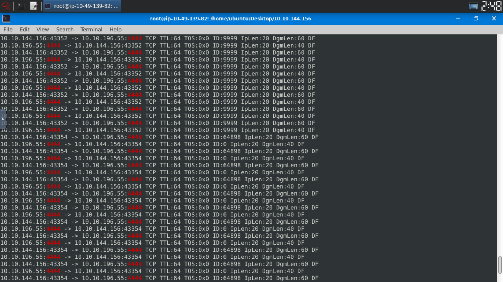

**Traffic pattern observed:**
```
10.10.144.156:43352 -> 10.10.196.55:4444  (outbound — compromised machine)
10.10.196.55:4444   -> 10.10.144.156:43352 (inbound — attacker C2 sending commands)
```

This bidirectional persistent connection on port 4444 is the classic signature of a Metasploit reverse shell. The compromised machine is "calling home" to the attacker's C2 server.

**Why port 4444 is a red flag:**
- Default Metasploit listener port
- No legitimate service runs on port 4444
- Persistent, bidirectional, high-frequency traffic = active shell session

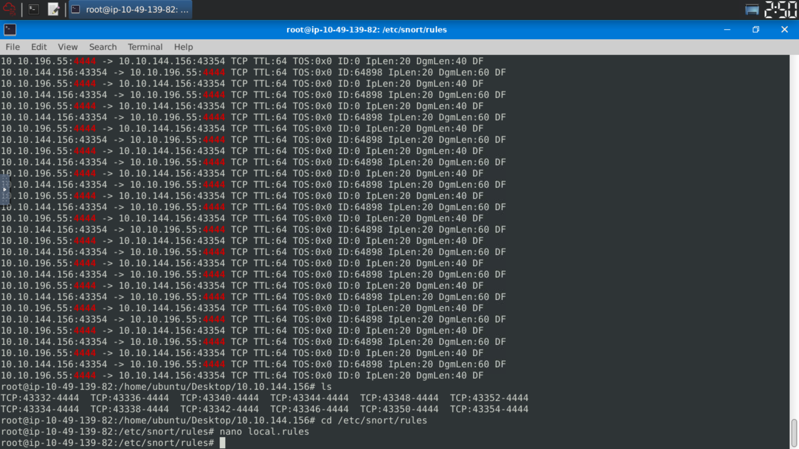

---

### Step 4 — Write the Reverse Shell Blocking Rule

```bash
cd /etc/snort/rules
nano local.rules
```

**Rule written:**

```snort
drop tcp any 4444 <> any any (msg:"Reverse Shell Detected"; sid:1000001; rev:1;)
```

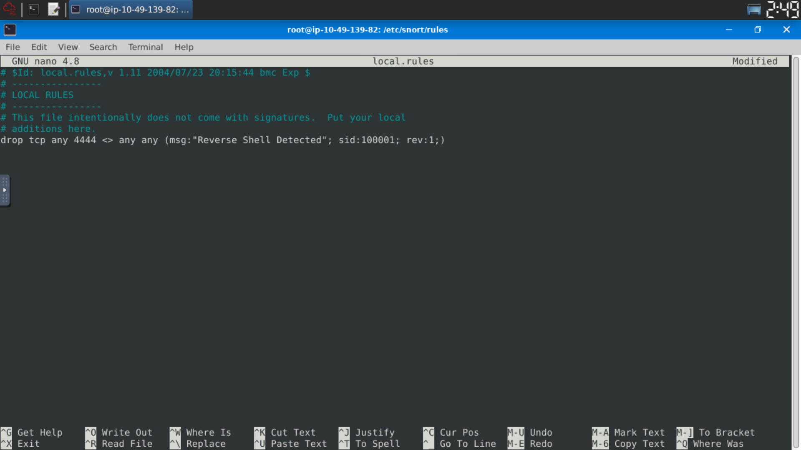

**Rule breakdown:**

| Component | Value | Meaning |
|---|---|---|
| `drop` | — | Block the packet |
| `tcp` | — | Protocol: TCP |
| `any` | Source IP | Any source (attacker could change IP) |
| `4444` | Source port | Metasploit default port |
| `<>` | — | **Bidirectional** — block both directions |
| `any any` | Destination | Any destination IP and port |
| `msg` | — | Alert message |
| `sid:1000001` | — | Unique rule ID |
| `rev:1` | — | Rule version 1 |

**Why bidirectional (`<>`) instead of one-way (`->`):**

A reverse shell creates a **two-way communication channel**. Using `->` would only block traffic in one direction. Using `<>` ensures both the outbound beacon from the victim AND the inbound commands from the attacker are dropped.

---

### Step 5 — Deploy Snort in IPS Mode

```bash
snort -c /etc/snort/snort.conf -q -Q --daq afpacket -i eth0:eth1 -A full
```

Same IPS deployment command as Scenario 1. Snort successfully detected and dropped all port 4444 traffic, severing the reverse shell connection. ✅

---

## Summary of Findings

| Item | Scenario 1 | Scenario 2 |
|---|---|---|
| **Attack Type** | SSH Brute-Force | Reverse Shell (Metasploit) |
| **Direction** | Inbound | Outbound |
| **Attacker IP** | 10.10.245.36 | 10.10.196.55 |
| **Victim IP** | 10.10.140.29 | 10.10.144.156 |
| **Port Targeted** | 22 (SSH) | 4444 (Metasploit) |
| **Evidence** | 111 TCP connections in ~8 seconds | Persistent bidirectional TCP on port 4444 |
| **Snort Action** | `drop` — one-way | `drop` — bidirectional (`<>`) |
| **Result** | Attack blocked ✅ | Shell severed ✅ |

---

## Snort Rules Summary

**Scenario 1 — SSH Brute-Force:**
```snort
drop tcp 10.10.245.36 any -> 10.10.140.29 22 (msg:"Blocked SSH Brute-Force Attempt from Attacker";sid:1000001;rev:1;)
```

**Scenario 2 — Reverse Shell:**
```snort
drop tcp any 4444 <> any any (msg:"Reverse Shell Detected"; sid:1000001; rev:1;)
```

---

## Key Snort Commands Reference

```bash
# Sniffer mode — capture and log traffic
sudo snort -dev -K ASCII -l .

# IPS mode — enforce rules inline
snort -c /etc/snort/snort.conf -q -Q --daq afpacket -i eth0:eth1 -A full

# Count connections per port from logs
ls | awk -F'-' '{print $NF}' | sort | uniq -c | sort -rn

# Check timestamps of specific connections
find . -maxdepth 1 -name "TCP:*-22" -printf '%T@ %p\n' | sort -n | head -20
```

---

## Lessons Learned

1. **Sniffer mode before IPS mode** — always capture and analyze raw traffic first before writing rules. Blind rule-writing leads to missed detections or false positives.

2. **Log folder names = source IPs** — Snort's `-K ASCII` mode organizes logs by source IP. This is a fast way to identify which external IPs generated the most traffic.

3. **Port 4444 = Metasploit default** — any persistent traffic on port 4444 from an internal machine is a strong indicator of compromise. This is the kind of pattern that should always be in a SOC's detection ruleset.

4. **Use `<>` for bidirectional protocols** — reverse shells, C2 beaconing, and any two-way communication require bidirectional rules. A one-way `->` rule would miss 50% of the traffic.

5. **Timestamps prove automation** — 111 SSH connections in ~8 seconds is impossible manually. Using `find` with `-printf '%T@'` to extract timestamps is a fast forensic technique to prove automated attacks.

6. **Insider threats move outbound** — Scenario 2 demonstrates that stopping inbound attacks is not enough. An already-compromised endpoint communicates outbound. Monitoring egress traffic is equally critical.

---

*Writeup produced as part of cybersecurity portfolio — TryHackMe Snort Challenge: Live Attacks — Said Almunawar*
